# FinLedger

A personal finance app for India that turns bank statements into budgets, bill
reminders, split expenses and mutual fund returns.


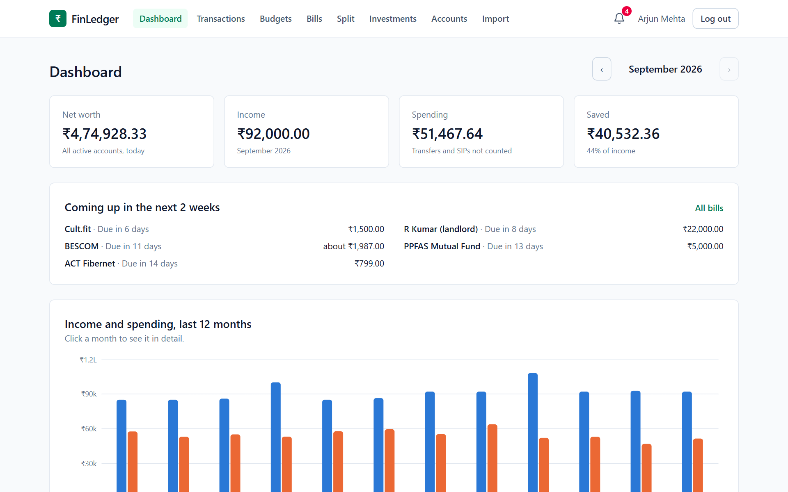

- [Overview](#overview)
- [Key features](#key-features)
- [Results](#results)
- [Tech stack](#tech-stack)
- [Architecture](#architecture)
- [Key design decisions](#key-design-decisions)
- [Getting started](#getting-started)
- [Usage](#usage)
- [API reference](#api-reference)
- [Testing](#testing)
- [Project structure](#project-structure)
- [Challenges and learnings](#challenges-and-learnings)
- [Roadmap](#roadmap)
- [License](#license)
- [Author](#author)

## Overview

Keeping track of money in India means juggling UPI payments, a couple of bank
accounts, a credit card, SIPs and the occasional trip where one friend pays for
everything. Banks give you a CSV and little else. Splitting apps don't know
what's in your bank account. Fund apps show a percentage that means little for
a SIP.

FinLedger is for someone who wants all of that in one place without typing it
in:

- **Imports:** upload a statement from HDFC, ICICI or SBI and the rows are
  sorted into categories.
- **Bills:** payments that repeat are found and turned into reminders.
- **Splitting:** shared costs are split to the paisa and settled in as few
  payments as possible.
- **Mutual funds:** they're valued at the latest NAV with a proper XIRR.
- **Linking it up:** repayments from friends and SIP instalments are picked up
  from the same bank statement.

It is a Spring Boot and MySQL back end with a React front end, run with Docker
Compose. A **Try the demo** button opens a throwaway account with a year of
sample data.

## Key features

- **Statement import:** CSVs from HDFC, ICICI and SBI (or a simple template) are
  read in the background, skipping rows already imported, and categorised by
  built-in and user-defined rules.
- **Budgets and alerts:** a monthly limit per category, with one notification
  at 80% and one when it's exceeded, never repeated within a month.
- **Recurring bills:** repeating payments are detected from transaction
  history, with a reminder three days before each confirmed bill is due.
- **Bill splitting:** four ways to split an expense (equally, exact amounts,
  percentages, shares), a settle-up plan with the fewest payments, and UPI pay
  links with QR codes.
- **Mutual funds:** real daily NAVs, gains, XIRR per fund and for the
  portfolio, and SIPs picked up from bank statements.
- **Secure sessions:** short-lived JWTs in memory and rotating refresh tokens
  in an HttpOnly cookie, with reuse detection.

## Results

- **187 automated tests:** 164 on the backend and 23 on the frontend. Most
  backend tests run through the real HTTP API against MySQL.
- **Fewer payments to settle up:** 65% fewer than settling each pair of friends
  separately, on average (12.9 payments down to 4.5). This was measured over
  1,000 simulated groups of 3 to 8 people.
- **Exact splits:** no paisa is ever lost to rounding, across 1,000 randomised
  splits in the unit tests and the 1,000 simulated groups above.
- **XIRR:** matches Excel's `XIRR()` to 6 decimal places on Excel's own worked
  example.
- **Duplicates:** re-uploading a 27-row statement adds nothing. An overlapping
  statement adds only its 14 new rows and skips the 12 already imported.
- **Categorisation:** 89% of rows (65 of 73) in the bundled sample statements
  are categorised by the built-in rules, before any user rules.
- **Bill detection:** all 10 repeating payments and income streams in a year of
  demo data (746 transactions) are found, with no false positives.

## Tech stack

- **Backend:**
  - Java 21 and Spring Boot 4.
  - Spring Security as an OAuth2 resource server, with HS256 JWTs.
  - Spring Data JPA and Hibernate, with Flyway migrations.
  - Bean Validation.
- **Database:** MySQL 8.4.
- **Frontend:** React 19, React Router, Vite, Tailwind CSS, Recharts, and
  qrcode.react for the UPI QR codes.
- **External data:** mfapi.in for mutual fund NAVs (AMFI data).
- **Testing:**
  - Backend: JUnit 5, AssertJ and MockMvc.
  - Frontend: Vitest.
  - Screenshots: Playwright.
- **Infrastructure:** Docker Compose, with nginx serving the frontend.

## Architecture

```
Browser ──▶ nginx :3000 ──/api──▶ Spring Boot ──▶ MySQL 8.4
            (React build)           │
                                    ├─ import worker pool (2 threads)
                                    ├─ after-commit: budget alerts, repayments, SIPs
                                    ├─ scheduled: 2:30 am checks, 11:40 pm NAVs, hourly cleanup
                                    └─▶ mfapi.in (fund NAVs, cached in MySQL)
```

nginx serves the built React app and forwards `/api` to the backend. The
backend isn't reachable from outside Docker's network. Inside it, controllers
call services, which own the business rules and the database transactions.
Three kinds of work happen off the request path:

- **Statement imports:** accepted straight away, then parsed on a small worker
  pool.
- **After-commit listeners:** once a change to the ledger has committed, they
  re-check budgets, look for friends paying you back, and turn new SIP debits
  into fund purchases. Each runs in its own transaction.
- **Scheduled jobs:** at 2:30 am Indian time the app rescans for recurring
  bills, sends reminders and re-checks budgets. At 11:40 pm, after AMFI
  publishes, it fetches the day's NAVs. Every hour it deletes expired demo
  users.

Flyway owns the schema (migrations `V1` to `V8`), and Hibernate only checks
that the entities match it. Fund data from mfapi.in is cached in MySQL, so no
page ever waits on it.

## Key design decisions

**Money is whole paise, never a float.** Every amount is a `BIGINT` of paise.
The frontend parses typed text digit by digit, so "0.1" is exactly 10 paise.
Where money has to be divided, the remainder is handed out on purpose: ₹100
split three ways is 33.34 + 33.33 + 33.33. That uses the largest remainder
method, with ties going to a fixed order, so the same input always gives the
same result. Units and NAVs, which are not money, are exact `DECIMAL`s.

**The database enforces what must never happen twice.** Duplicate statement
rows, repeated notifications and repeated suggestions are all blocked by unique
keys, not by "check, then insert", which two concurrent requests can both pass.
Each imported row gets a fingerprint: a SHA-256 of the account, date, amount,
cleaned description and occurrence number. The occurrence number means two real
₹20 chai payments on one day both survive. Imports into one account are
serialised by locking its row.

**Side effects never break the main action.** Budget alerts, repayment matching
and SIP syncing run after the user's change has committed, each in its own
transaction, and errors there are logged and swallowed. An alert that fails
cannot turn a successful save into an error.

**Greedy debt simplification, accepted as not always optimal.** Finding the
fewest payments that settle a group is NP-hard. The plan first pairs people who
owe exactly what someone else is owed. Then the biggest debtor pays the biggest
creditor until everyone is square. It never needs more than n - 1 payments for
n people, and in simulation it cut payments by 65% against settling pair by
pair.

**XIRR solved numerically, and only when it means something.** There's no
closed form, so it uses Newton's method, falling back to bisection if Newton
wanders off. It's hidden until money has been invested for 30 days, because a
few days' return, annualised, is noise. Redemptions use average cost, which
suits a portfolio view. It is not the first-in-first-out that tax filing needs.

**Tokens designed around theft.** The access token lives only in memory. The
refresh token is an HttpOnly, SameSite=Strict cookie scoped to `/api/auth`,
rotated on every use and stored only as a hash. An old refresh token reused
after a 30-second grace window revokes the whole session. The grace window
allows for two tabs refreshing at once. Logging in with an unknown email still
runs a BCrypt check against a dummy hash, so response times don't reveal which
emails have accounts.

**Nothing slow inside a transaction.** Fetching fund prices from mfapi.in
happens before a request's database transaction starts, and fund data is
written with MySQL upserts. A slow network never holds locks, and two requests
fetching the same fund can't clash.

**No boolean columns.** "Archived", "demo user" and "read" are nullable
timestamps (`archived_at`, `demo_expires_at`, `read_at`), which record when as
well as whether. "Today" is worked out in Indian time and timestamps are stored
in UTC. The clock is injected, so tests can move time.

## Getting started

### Prerequisites

- Docker Desktop, or Docker Engine with Compose v2.
- An internet connection when the app starts, for fund prices from
  [mfapi.in](https://www.mfapi.in).
- To run without Docker or run the tests:
  - JDK 21.
  - Node 22.12 or newer.
  - MySQL 8.4, or just the database container.

### Installation

```bash
git clone https://github.com/kaushiksridhar17/finledger.git
cd finledger
cp .env.example .env          # Copy-Item .env.example .env on Windows PowerShell
```

### Environment variables

`.env` is read by Docker Compose and is never committed.

- `DB_NAME`, `DB_USER`, `DB_PASSWORD`: the application's MySQL database and
  user.
- `DB_ROOT_PASSWORD`: MySQL's root password, used only inside the container.
- `JWT_SECRET`: signs every login token. Set it to a random string of at least
  32 characters, for example the output of `openssl rand -base64 48` (Git Bash
  has `openssl` on Windows).

The development passwords in `.env.example` are fine on your own machine;
change them if it's shared.

### Run with Docker

```bash
docker compose up --build
```

Open http://localhost:3000 and click **Try the demo**, or create an account.
MySQL is published on port 3307, so it doesn't clash with a local MySQL on
3306.

```bash
docker compose down        # stop, keep the data
docker compose down -v     # stop and wipe the database
```

### Run without Docker

```bash
docker compose up -d db
```

```bash
cd backend
./mvnw spring-boot:run     # .\mvnw.cmd spring-boot:run on Windows
```

```bash
cd frontend
npm install
npm run dev
```

Open http://localhost:5173. Vite forwards `/api` to the backend on port 8080,
and the backend's defaults match `.env.example`.

## Usage

**Log in, or try the demo.** The demo account comes with:
- a year of transactions across four accounts
- budgets and confirmed bills
- two split groups
- a small mutual fund portfolio

It's deleted after 24 hours, and at most 200 exist at once.

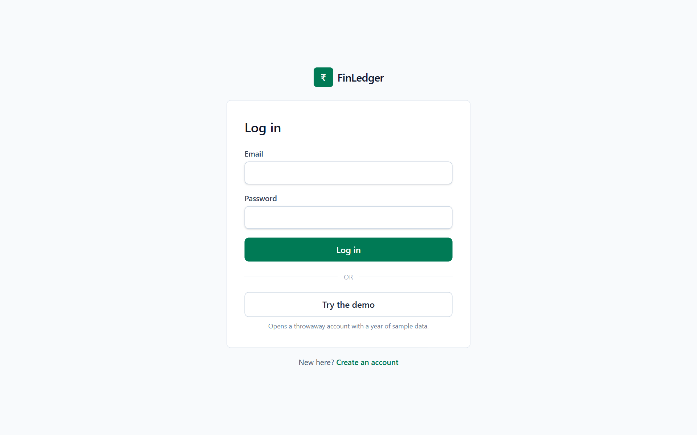

**Transactions.** Search and filter by account, category, direction and date.
Balances are worked out from the transactions, never stored.

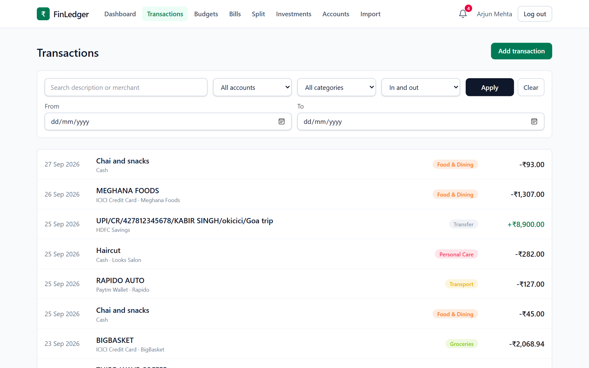

**Import a statement.** Choose the account and the CSV. The page shows each
import's progress, how many rows were added or skipped, and any line that
couldn't be read. Your own rules ("description contains CHAI POINT → Food &
Dining") are checked before the built-in ones.

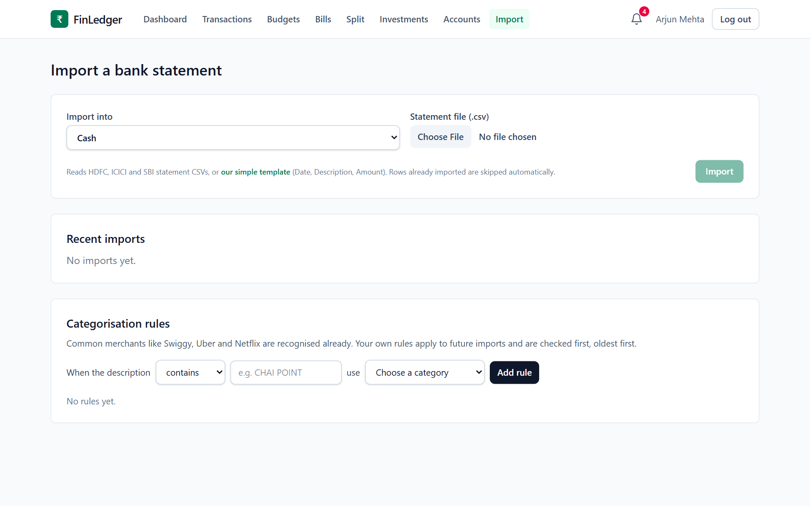

**Budgets and notifications.** Spending against each monthly limit. Alerts
arrive under the bell.

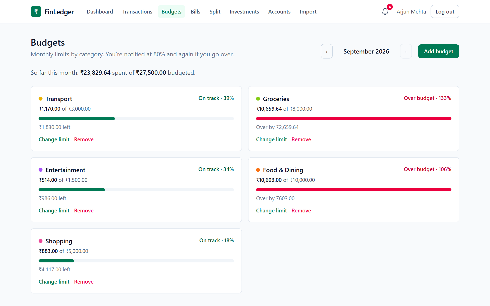

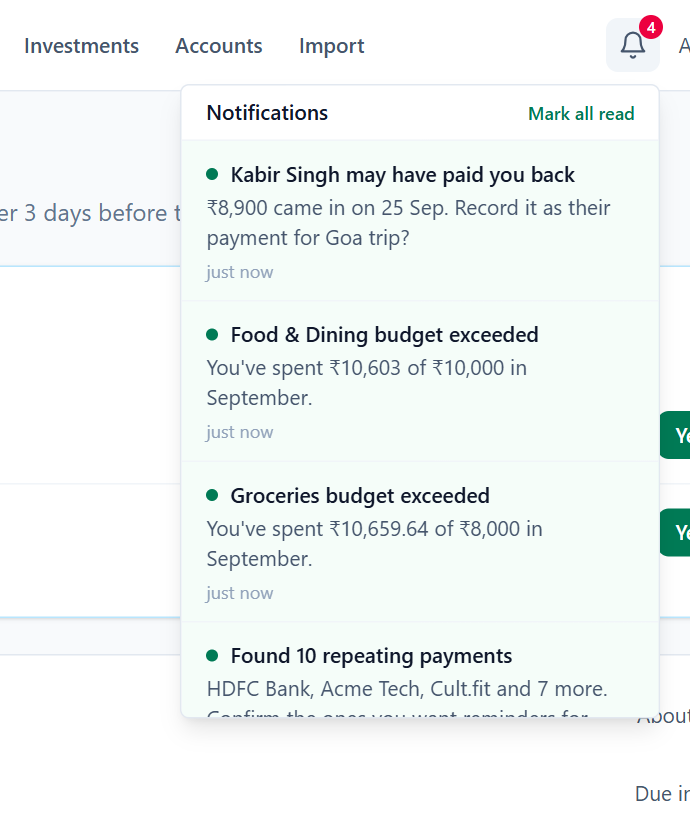

**Bills.** Detected repeating payments. Confirm the ones you want reminders
for; dismissed ones stay dismissed after a rescan.

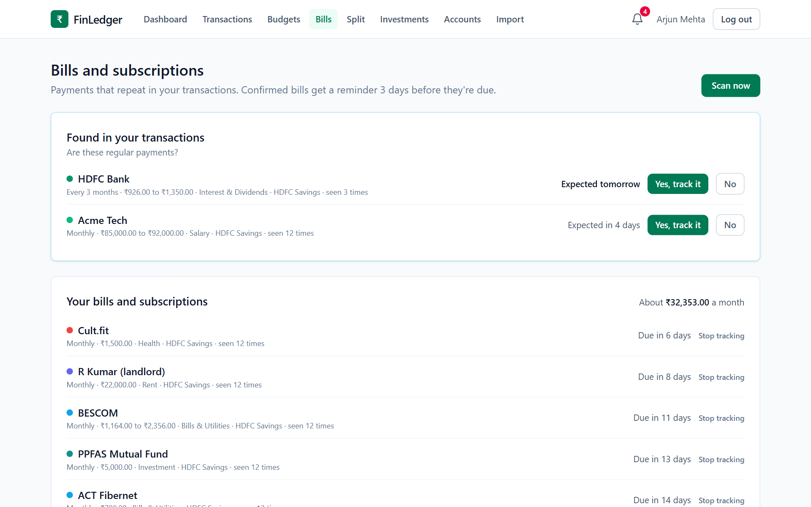

**Split a trip.** The group page shows the settle-up plan, everyone's balance,
and a card when money in your bank looks like a friend paying you back.

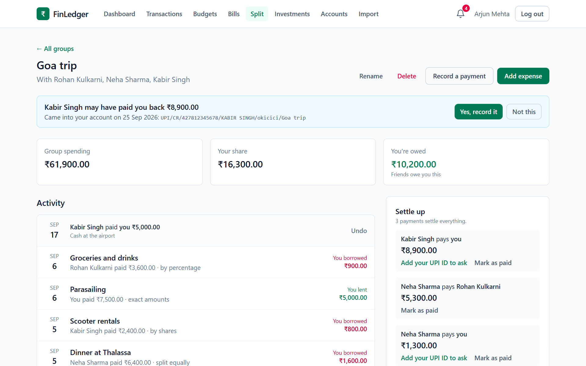

Adding an expense shows each person's share as you type, whichever way it's
split.

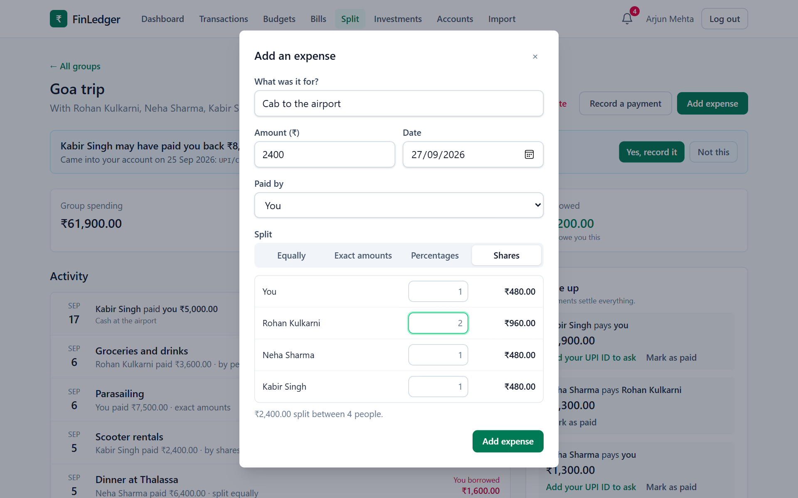

Paying a friend opens a UPI link, or a QR code to scan with GPay, PhonePe or
Paytm.

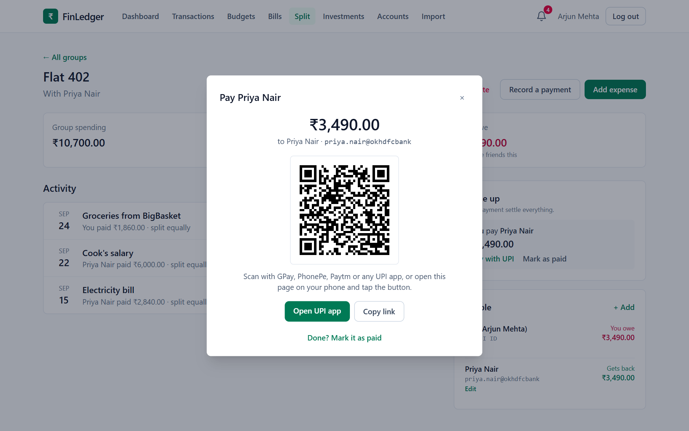

**Mutual funds.** Value, gain and XIRR for each fund and the portfolio, value
against money invested over the year, and linked SIPs.

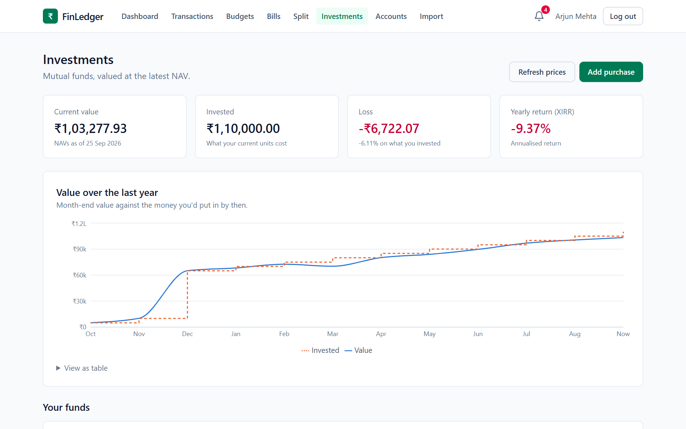

Record a purchase by searching for the fund. Units come from that day's NAV.

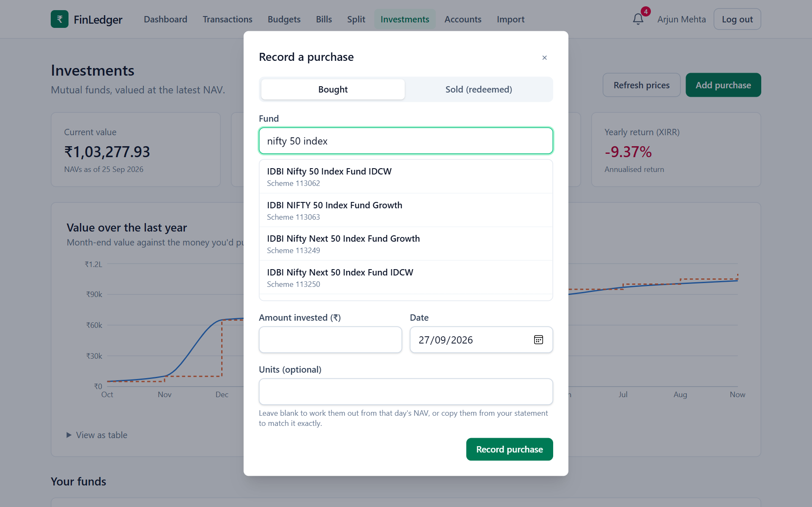

## API reference

Every endpoint except the `/api/auth` ones needs an `Authorization: Bearer
<token>` header. Errors are [RFC 9457](https://www.rfc-editor.org/rfc/rfc9457)
problem details. A validation error also carries an `errors` object keyed by
field.

**Auth and user:**
- `POST /api/auth/register`
- `POST /api/auth/login`
- `POST /api/auth/demo`
- `POST /api/auth/refresh`
- `POST /api/auth/logout`
- `GET /api/users/me`

**Ledger:**
- `GET POST /api/accounts`, `PUT DELETE /api/accounts/{id}`
- `GET POST /api/categories`
- `GET POST /api/transactions` (filters: `accountId`, `categoryId`, `from`,
  `to`, `direction`, `q`, `page`, `size`)
- `GET PUT DELETE /api/transactions/{id}`
- `GET /api/dashboard?month=2026-09`

**Imports:**
- `POST /api/imports` (multipart: `accountId`, `file`), `GET /api/imports`,
  `GET /api/imports/{id}`
- `GET POST /api/category-rules`, `DELETE /api/category-rules/{id}`

**Budgets, bills and notifications:**
- `GET POST /api/budgets`, `GET /api/budgets/suggestions`,
  `PUT DELETE /api/budgets/{id}`
- `GET /api/recurring`, `GET /api/recurring/upcoming`,
  `POST /api/recurring/scan`
- `POST /api/recurring/{id}/confirm`, `POST /api/recurring/{id}/dismiss`
- `GET /api/notifications`, `POST /api/notifications/{id}/read`,
  `POST /api/notifications/read-all`

**Split groups:** every change returns the whole updated group.
- `GET POST /api/groups`, `GET PUT DELETE /api/groups/{groupId}`
- `POST /api/groups/{groupId}/members`,
  `PUT DELETE /api/groups/{groupId}/members/{memberId}`
- `POST /api/groups/{groupId}/expenses`,
  `PUT DELETE /api/groups/{groupId}/expenses/{expenseId}`
- `POST /api/groups/{groupId}/settlements`,
  `DELETE /api/groups/{groupId}/settlements/{settlementId}`
- `POST /api/groups/{groupId}/matches/{matchId}/accept`,
  `POST /api/groups/{groupId}/matches/{matchId}/dismiss`

**Mutual funds:**
- `GET /api/investments`, `GET /api/investments/search?q=parag`,
  `POST /api/investments/refresh`
- `POST /api/investments/transactions`,
  `DELETE /api/investments/transactions/{id}`
- `GET /api/investments/sip-suggestions`, `POST /api/investments/sip-links`,
  `DELETE /api/investments/sip-links/{id}`

Example: adding an expense split by shares. All amounts are in paise.

```http
POST /api/groups/7/expenses
Content-Type: application/json

{
  "description": "Villa in Anjuna, 3 nights",
  "amountPaise": 1800000,
  "date": "2026-09-04",
  "paidByMemberId": 2,
  "splitType": "SHARES",
  "shares": [
    { "memberId": 1, "value": 1 },
    { "memberId": 2, "value": 2 },
    { "memberId": 3, "value": 1 }
  ]
}
```

In a new three-person group, where this is the only expense, the response is
the updated group. It includes the new settle-up plan:

```json
{
  "id": 7,
  "name": "Goa trip",
  "totalSpentPaise": 1800000,
  "mySharePaise": 450000,
  "myBalancePaise": -450000,
  "settleUp": [
    { "fromMemberId": 1, "fromName": "Arjun Mehta", "toMemberId": 2, "toName": "Rohan Kulkarni", "amountPaise": 450000 },
    { "fromMemberId": 3, "fromName": "Neha Sharma", "toMemberId": 2, "toName": "Rohan Kulkarni", "amountPaise": 450000 }
  ],
  "members": [ "..." ],
  "expenses": [ "..." ],
  "settlements": [ "..." ],
  "suggestions": [ "..." ]
}
```

## Testing

The backend tests use a separate `finledger_test` database, created by
`docker/mysql-init` the first time the database container starts, so they never
touch your data.

```bash
docker compose up -d db
cd backend
./mvnw test                # 164 tests; .\mvnw.cmd test on Windows
```

```bash
cd frontend
npm test                   # 23 tests
npm run lint
```

What they cover:

- **Through the real API, with MockMvc against MySQL:**
  - Registration, login and token rotation, including reuse of a stolen
    refresh token.
  - Transactions, budgets and alerts.
  - Importing the same and overlapping statements.
  - Split groups and settling up.
  - Repayment and SIP matching.
  - Mutual funds.
  - The demo.
  - That no user can see or change another's data.
- **Pure logic, without Spring:**
  - The CSV reader, the bank formats and the categoriser.
  - Recurring detection.
  - Split rounding and debt simplification, including 1,000 random splits and
    1,000 random groups.
  - XIRR against Excel, NAV lookups around weekends, and average cost.
- **Frontend:** money parsing, dates, split previews and UPI links.

Fund prices in tests come from a fake NAV source with fixed prices, so no test
needs the internet.

The screenshots in this README are taken from the running app by a script. It
opens Microsoft Edge (or Chrome), clicks **Try the demo** and saves each page
to `docs/images`:

```bash
cd frontend
npm run screenshots        # add -- --show to watch it
```

## Project structure

```
backend/src/main/java/com/kaushiksridhar/finledger/
  auth/, security/, user/     login, token rotation, the current user
  account/, category/,
  transaction/                the ledger
  importing/                  upload, background processing; csv/ and format/ per bank
  rules/                      built-in and user categorisation rules
  dashboard/                  monthly totals and category breakdown
  budget/, recurring/,
  notification/, alerts/      budgets, bill detection, reminders, the jobs behind them
  split/                      groups, split maths, debt simplification, repayment matching
  investment/                 NAV source and cache, XIRR, holdings, SIP linking
  demo/                       demo data and cleanup
  common/                     errors, money formatting, time, paging
backend/src/main/resources/db/migration/   V1 to V8
frontend/src/
  api/                        one module per part of the API
  auth/                       in-memory access token and silent refresh
  components/                 shared pieces, plus a folder per feature
  lib/                        money, dates, splits, UPI links, each with tests
  pages/                      one per screen, loaded on demand
frontend/scripts/             the screenshot script
docker/mysql-init/            creates the test database
```

## Challenges and learnings

- **An alert could turn a save into an error.** Budget checks ran after the
  user's change had committed, but an exception there still reached the HTTP
  response, so a transaction that was saved came back as a failure. Giving
  the checks their own transaction and logging their errors instead made "side
  effects never break the main action" a rule.
- **Background work races the tests.** Import tests were flaky because budget
  alerts ran after an import was marked complete, so a test could read the
  finished import before its alerts existed. Alerts now run before the import
  is marked complete, which is also what a user would expect.
- **Two identical rows are not always a duplicate.** A hash of date, amount
  and description treats two ₹20 chai payments on one day as one. Adding an
  occurrence count to the fingerprint keeps both while still catching
  re-imports.
- **Transaction snapshots hide other requests' work.** Fetching fund prices
  inside the demo's database transaction would have held locks during a
  network call. Under MySQL's REPEATABLE READ it could also miss prices cached
  by another request mid-transaction. Fetching before the transaction starts
  fixes both.
- **Real bills are messy.** Electricity amounts swing month to month, so the
  detector's amount tolerance had to go from 40% to 50%. It still has to
  reject irregular spending like food delivery.
- **Browsers disagree about dates.** "Sep" in one browser was "Sept" in
  another, which broke a test. Months are now formatted from a fixed list.

## Roadmap

- **PDF statements:** most banks offer PDF more readily than CSV.
- **Notifications outside the app:** email or push, so bill reminders reach you
  when the app is closed.
- **Shared groups:** friends could log in and add expenses themselves; today a
  group belongs to the person who made it.
- **Capital gains:** first-in-first-out lots for tax filing, next to the
  average-cost view.
- **More than one currency:** users already have a base currency column, but
  everything is in rupees.
- **A hosted demo, and CI** to run the tests on every push.

## License

MIT, see [LICENSE](LICENSE). Copyright (c) 2026 Kaushik Sridhar.

## Author

Kaushik Sridhar, [@kaushiksridhar17](https://github.com/kaushiksridhar17) on GitHub.
